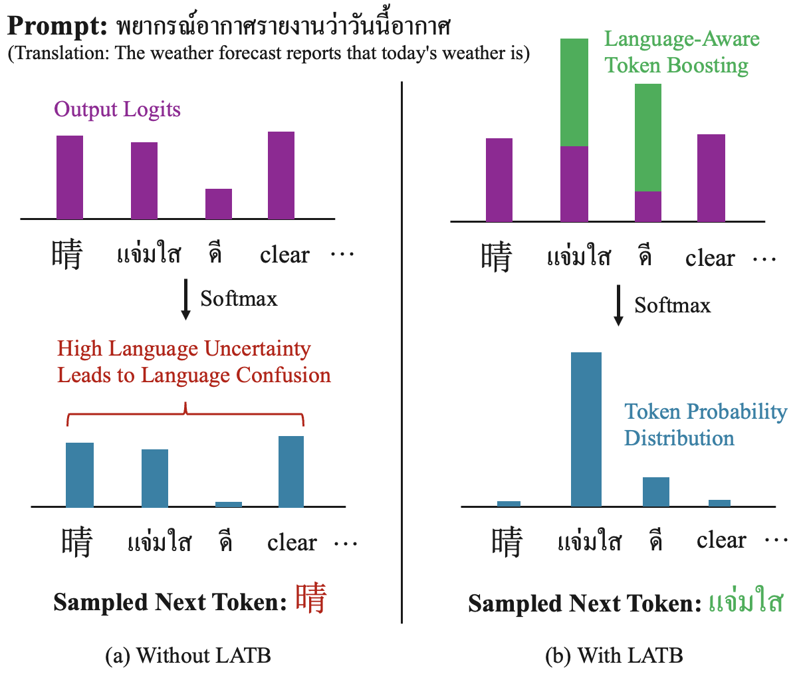

# Language-Aware Token Boosting

<div align="center">
    
</div>

This research aims to enhance the multilingual capabilities of English-centric LLMs through logits perturbation. We present two variants of the logits perturbation method: Language-Aware Token Boosting (LATB) and its adaptive version, Adaptive-LATB. Our extensive experiments on the XLSUM dataset highlight the superior language alignment and summarization performance of our method compared to multilingual-tuned models. Additionally, our method does not require any costly fine-tuning. The research paper will be published soon.

## Motivation

English-centric LLMs face language confusion issues due to their predominantly English-centric training datasets. With the growing global demand for LLMs, there have been several attempts to enhance their multilingual capabilities. Effective approaches include fine-tuning LLMs to align with target languages or training multilingual models from scratch. However, these methods require substantial computational resources. This research proposes a novel approach to improving the multilinguality of LLMs while maintaining very low computational costs through logits perturbation.

## Methods

We present two logits perturbation methods to improve language alignment

1. **Language-Aware Token Boosting (LATB)** - Increase logits of the tokens which belong to target language
2. **Adaptive Language-Aware Token Boosting (Adaptive-LATB)** - Adaptively increase logits of the tokens which belong to target language when the model is not confident in the language


## Project Setup

### CUDA Setup

This project uses CUDA version 12.4 which you can install from [here](https://developer.nvidia.com/cuda-12-4-0-download-archive?target_os=Linux&target_arch=x86_64&Distribution=Ubuntu&target_version=22.04&target_type=deb_local).


### Dependencies Installation
For the dependency management, we uses [Poetry](https://python-poetry.org/). To install the dependencies, run:

```bash
poetry install
```

To activate the virtual environment, run:

```bash
poetry shell
```

Since Flash Attention package requires an installation flag, and poetry doesn't support this feature. We can install it separately.

```bash
pip install flash-attn==2.6.3 --no-build-isolation
```

### Dataset and Models

To replicate the experiments, please clone dataset and models to your local machine.

1. [XLSUM Dataset](https://huggingface.co/datasets/csebuetnlp/xlsum) - Multilingual summarization dataset
2. [Llama3 8B Instruct](https://huggingface.co/meta-llama/Meta-Llama-3-8B-Instruct) - Base model
3. [Suzume 8B Multilingual](https://huggingface.co/lightblue/suzume-llama-3-8B-multilingual) - Multilingual fine-tuned model as a baseline

### FastText Language Identification

We use off-the-shelf FastText for language identification (LID). The LID model can be downloaded [here](https://fasttext.cc/docs/en/language-identification.html).

### `.env` File

Please create a new `.env` file in the project root directory to specify dataset and model paths. Please follow the format in `.env.sample` we have provided. 

## Experiments

### LATB

- **LATB** <br> This script will generate responses with languages in `LANG_CODES` with the vanilla LATB settings. If you are using a GPU having VRAM more than 24GB, you can consider increasing the `--batch_size` argument to make the response generation faster.
    ```bash
    cd experiments/sum/scripts/
    ./vanilla_latb.sh
    ```
- **Alpha Varying Experiment** <br> Alpha is a hyperparameter in LATB. For the alpha varying experiment, please run the following command to generate responses corresponding to alpha values in the `ALPHA_LIST`
    ```bash
    cd experiments/sum/scripts/
    ./vinilla_latb_alpha_varrying.sh
    ```

### Adaptive-LATB

- **Adaptive-LATB** <br> 
    Generate responses using the Adaptive-LATB settings with languages in `LANG_CODES`. An important parameter that you may want to modify is `thresh_diff` (beta) determining the level of confidence threshold to boost token value
    ```bash
    cd experiments/sum/scripts/
    ./adaptive_latb.sh
    ```
- **Beta Varying Experiment** <br> Beta is a hyperparameter in Adaptive-LATB. For the beta varying experiment, please run the following command to generate responses corresponding to beta values in the `BETA_LIST`
    ```bash
    cd experiments/sum/scripts/
    ./vinilla_latb_alpha_varrying.sh
    ```


### Baselines
- **Llama3 8B Instruct** <br>
    ```bash
    cd experiments/sum/scripts/
    ./local_llama3.sh
    ```
- **Suzume 8B** <br>
    Suzume 8B is a multilingual fine-tuned version of Llama3 8B-I. To generate responses in 8 selected languages, please run the following command:
    ```bash
    cd experiments/sum/baselines
    python suzume.py
    ```

## Evaluation
- **Evaluate a folder** <br>
    Evaluate responses in a folder and generate a result summary file
    ```bash
    cd latb/evaluate
    pyton eval_folder.py -f <path_to_folder>
    ```

## Developers and Maintainers

SCB DataX AI Scientist team
- [Trapoom Ukarapol](https://github.com/trapoom555)
- [Pakhapoom Sarapat](https://github.com/pakhapoom)
- [Nut Chukamphaeng](https://github.com/nutorbit)
